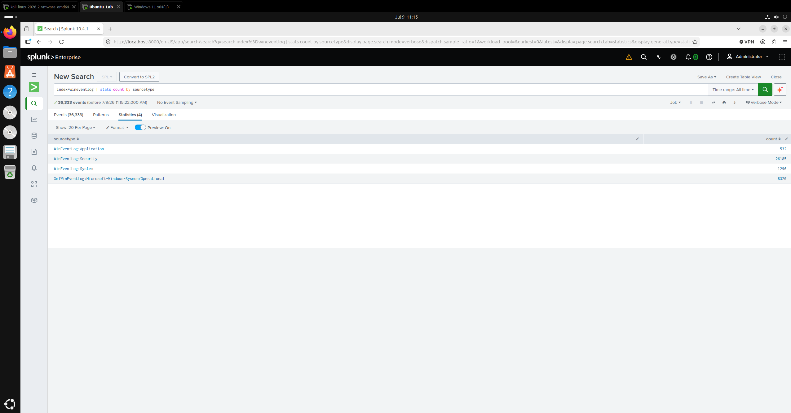
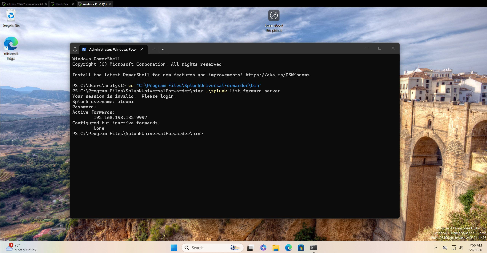
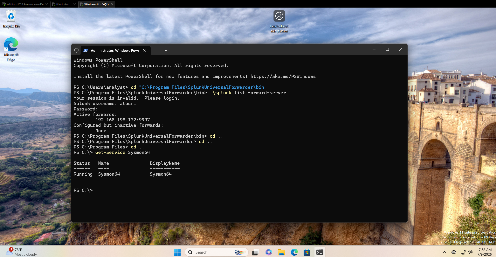
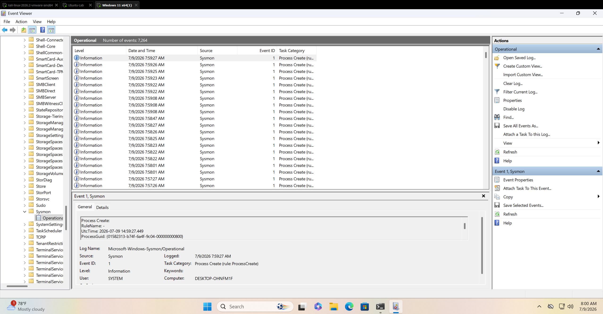
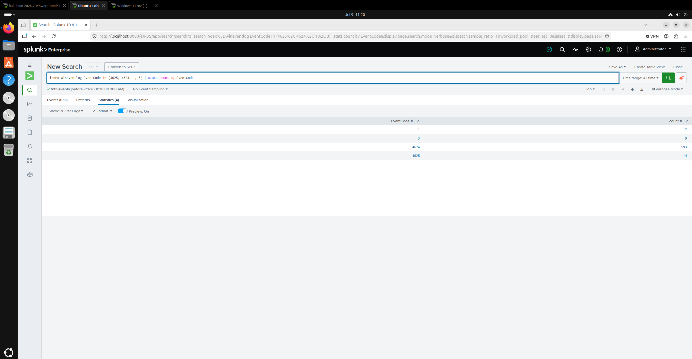
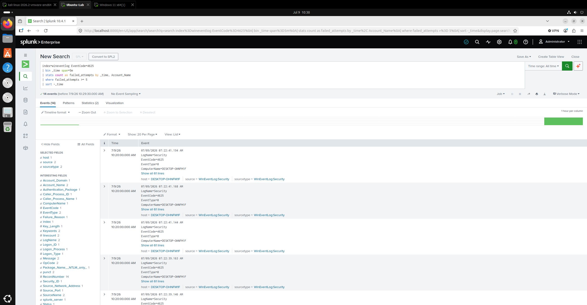
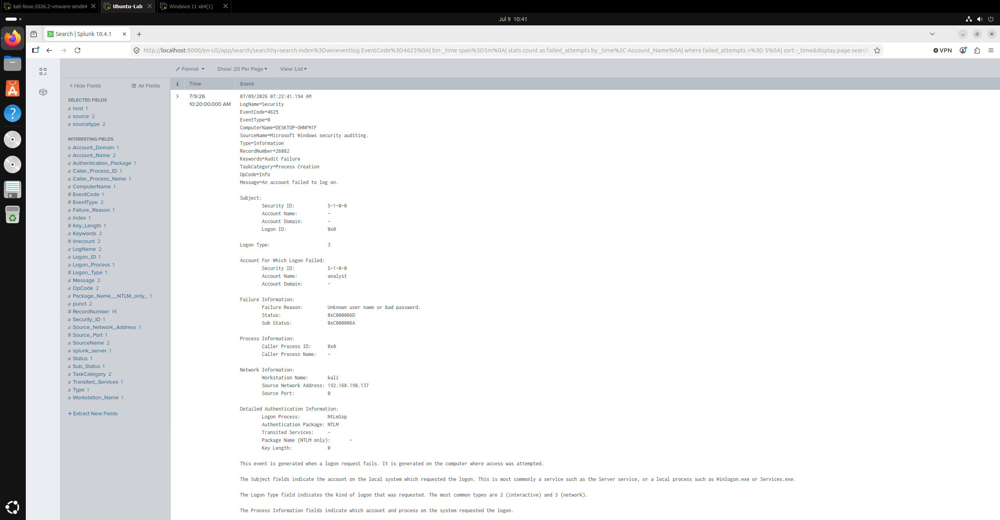
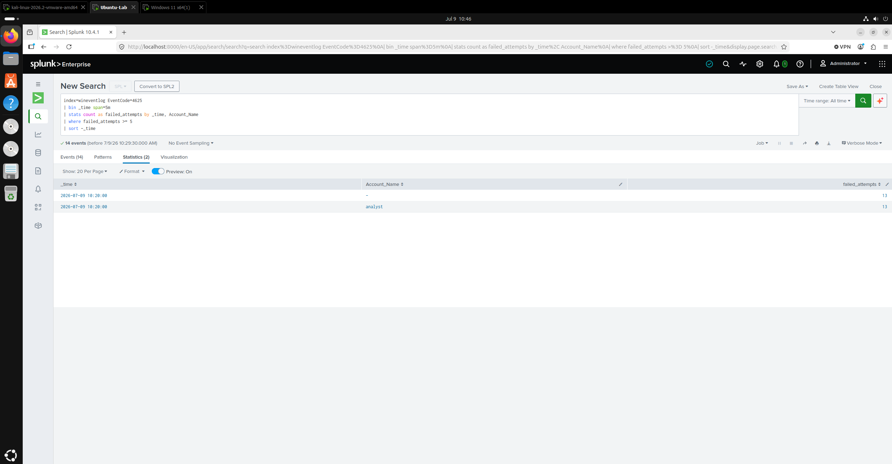
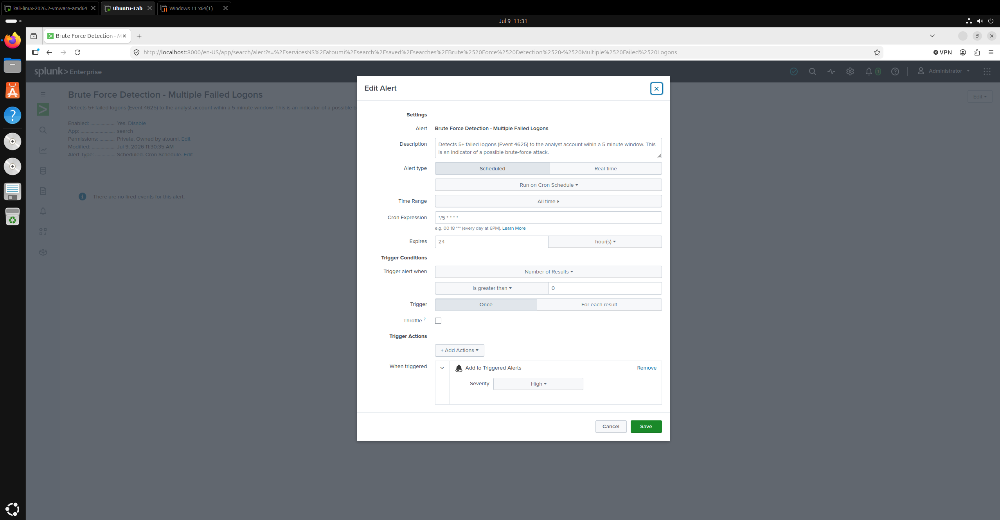
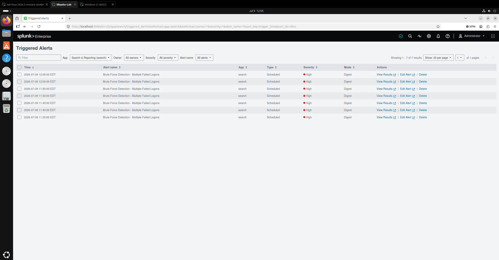

# Splunk SIEM Home Lab - Windows Endpoint Detection & Brute-Force Alerting

A security monitoring lab built from scratch: deployed **Splunk Enterprise** as a SIEM, created a **Windows 11** endpoint with **Sysmon** and the **Splunk Universal Forwarder**, then simulated attacks from **Kali Linux**, and built and validated a **scheduled detection alert** for brute-force attempts.

---

## Overview

This project builds a complete detection pipeline that would realistically be used in a SOC workflow: **instrument -> collect -> attack -> detect -> alert.**

The goal was to simulate a full analyst lifecycle, from forwarding realistic endpoint telemetry into Splunk, to generating malicious activity against a monitored host, then writing detection logic to separate that activity from normal noise, and turning that search into an automated alert that triggers on its own.

The result is a working detection that automatically triggers when an account is targeted with brute-force.

---

## Lab Architecture

Three virtual machines on an isolated VMware NAT network (`192.168.198.0/24`):

| VM | Role | Operating System | IP Address | Key Software |
|----|------|------------------|------------|--------------|
| `Ubuntu-Lab` | SIEM / Indexer | Ubuntu 24.04 | `192.168.198.132` | Splunk Enterprise |
| `DESKTOP-OHNFM1F` | Monitored Endpoint | Windows 11 Enterprise (Evaluation) | `192.168.198.136` | Sysmon, Splunk Universal Forwarder |
| `kali` | Attacker | Kali Linux | `192.168.198.137` | hydra, nmap |

**Data flow:**

```
[ Windows 11 Endpoint ]                      [ Ubuntu - Splunk Indexer ]
  Sysmon (telemetry)                            Receiving port 9997
  Universal Forwarder  ──────── TCP 9997 ─────► wineventlog index
                                                       │
[ Kali - Attacker ]                                    ▼
  hydra / nmap  ──── brute force / recon ──►    Search • Detection • Alert
        (targets the Windows endpoint)
```

The Ubuntu indexer was assigned a **static IP** so the forwarder connection survives reboots. 

---

## Data Sources Collected

The Universal Forwarder sends four log channels from the Windows endpoint into a dedicated `wineventlog` index:

- **Windows Security** - authentication events, including failed logons (Event ID 4625) and successful logons (Event ID 4624)
- **Windows System** - system-level events
- **Windows Application** - application events
- **Sysmon Operational** - process creation (Event ID 1) and network connections (Event ID 3)

Sysmon was deployed with the **SwiftOnSecurity** configuration, the community-standard baseline tuned to reduce noise while capturing the events analysts care about.

Verification that all four sources are ingesting correctly:



---

## Build Summary

1. **Splunk indexer** - installed Splunk Enterprise on Ubuntu, enabled receiving on port `9997`, and created the `wineventlog` index.
2. **Endpoint instrumentation** - installed Sysmon with the SwiftOnSecurity config and verified events were populating the Sysmon Operational channel.
3. **Log forwarding** - deployed the Universal Forwarder with a custom `inputs.conf` (see [`configs/`](configs/)) collecting all four channels. The forwarder service runs as **Local System** so it can read every log channel, including Sysmon.
4. **Verification** - confirmed the forwarder was actively connected and all four sourcetypes were ingesting.

Forwarder actively connected to the indexer, and Sysmon running on the endpoint:





---

## Attack Simulation

From the Kali Linux machine, reconnaissance and a brute-force attack were run against the Windows endpoint's remote-access services, targeting the local `analyst` account:

- **Reconnaissance** - `nmap` service/port scan of the endpoint.
- **Brute force** - `hydra` password-guessing against the `analyst` account over RDP and SMB.

Each failed authentication attempt generates a **Windows Security Event ID 4625 (An account failed to log on).** These are the events the detection is built to catch.

Event-code summary showing the attack-relevant activity landing in Splunk - failed logons (4625), successful logons (4624), and Sysmon process/network events (1 and 3):



---

## Detection Engineering

The core challenge of this lab is filtering out a **brute-force pattern** from ordinary failed logons. A single Event 4625 is meaningless because users mistype passwords all the time. The signal is **many failures against one account in a short time window.**

**Final detection query** ([`detections/brute-force-4625.spl`](detections/brute-force-4625.spl)):

```spl
index=wineventlog EventCode=4625 Account_Name="analyst"
| bin _time span=5m
| stats count as failed_attempts by _time
| where failed_attempts >= 5
| sort -_time
```

**How it works:**

- `EventCode=4625 Account_Name="analyst"` - narrows to failed logons against the targeted account.
- `bin _time span=5m` - groups events into 5-minute windows.
- `stats count as failed_attempts by _time` - counts failures per window.
- `where failed_attempts >= 5` - the detection threshold; 5 or more failures in 5 minutes separates a brute-force attempt from a user error.
- The result collapses a burst of failed logons into a **single detection row**.

**MITRE ATT&CK:** [T1110 - Brute Force](https://attack.mitre.org/techniques/T1110/)

The raw failed-logon events with the characteristic burst on the timeline:



The detection logic collapsing the burst into a single flagged result:



A single 4625 event in detail, confirming the source of the attack (`analyst` account, attacker workstation `kali`, source IP `192.168.198.137`, network logon via NTLM):



---

## Alerting

The detection was saved as a **scheduled alert**, turning a manual search into an automated control:

- **Type:** Scheduled, running every 5 minutes (cron `*/5 * * * *`)
- **Trigger condition:** number of results is greater than 0 (the `>= 5` threshold logic lives inside the search, so any returned row is a genuine detection)
- **Action:** Add to Triggered Alerts
- **Severity:** High

Alert configuration:



The alert was then **validated against a live attack** by re-running the brute force and confirming the alert triggered automatically on its next scheduled run:



---

## Challenges & Solutions

The debugging that made this a real pipeline rather than a tutorial walkthrough:

**1. Sysmon logging locally but not forwarding.**
After deploying the forwarder, only three of the four sourcetypes showed up in Splunk, Sysmon was missing, even though I checked that it was running and writing events locally. Root cause: the forwarder service account could read the Security, System, and Application channels but was denied access to the Sysmon Operational channel. **Fix:** I set the Universal Forwarder service to run as **Local System**, which can read all channels. Sysmon appeared immediately after restarting.

**2. Two `Account_Name` fields in 4625 events.**
Every failed-logon event had *two* account names, the (blank) Subject account that requested the logon, and the actual targeted account. Grouping by account made a duplicate row for the blank account alongside the real one. **Fix:** filtered the query to the targeted account and grouped only by time window, making one clean detection row per window.

**3. Alert triggering repeatedly for a single attack.**
The alert triggered seven times for one brute-force attack because the alert's time range was set to "All time". Each scheduled run scanned the entire dataset, which triggered the alert each time. The fix is to change the scope of the alert to a shorter rolling window, and add throttling which suppresses repeated notifications for the same entity for a set period so analysts aren't spammed for one incident. I added these as possible future improvements.

---

## Skills Demonstrated

- **SIEM deployment & administration** - Splunk Enterprise install, indexing, receiving configuration
- **Endpoint telemetry** - Sysmon deployment and configuration
- **Log forwarding architecture** - Universal Forwarder, `inputs.conf`, multi-channel collection
- **Detection engineering** - SPL, time-window aggregation, thresholding, and query tuning
- **Alerting** - scheduled alert creation and live validation
- **Attack simulation** - reconnaissance and brute force with nmap and hydra
- **Troubleshooting** - log-source diagnosis, service permissions, field analysis, and network configuration
- **Threat frameworks** - MITRE ATT&CK technique mapping

---

## Repository Structure

```
splunk-siem-detection-lab/
├── README.md
├── configs/
│   └── inputs.conf              # Universal Forwarder input config (Security/System/App/Sysmon)
├── detections/
│   └── brute-force-4625.spl     # Final brute-force detection query
└── screenshots/
    ├── 01-splunk-ingestion-sourcetypes.png
    ├── 02-forwarder-active.png
    ├── 03a-sysmon-service.png
    ├── 03b-sysmon-operational-log.png
    ├── 04-attack-eventcode-summary.png
    ├── 05-brute-force-4625-events-timeline.png
    ├── 06-brute-force-detection-statistics.png
    ├── 07-brute-force-4625-event-detail.png
    ├── 08-alert-config.png
    └── 09-triggered-alert.png
```

---

## Possible Improvements / Future Work

- **Alert throttling** - suppress duplicate notifications for the same account within a time window.
- **Additional detections** - Sysmon process-creation anomalies (Event ID 1), suspicious PowerShell execution, and network-scan detection using Sysmon network events (Event ID 3).
- **ATT&CK coverage** - map more detections to MITRE ATT&CK techniques to better understand what behaviors I can catch, and what I'm blind to.
- **Dashboard** - a summary dashboard visualizing detections and endpoint activity.
- **Expanded log sources** - bring additional hosts and log types into the index to broaden monitoring.
